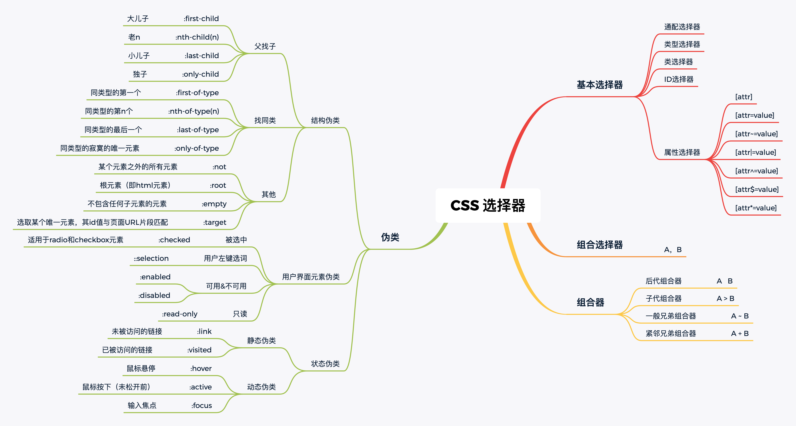

## BFC
### 什么是BFC
Block Format Context, 简单来说就是一个独立不干扰外界也不受外界干扰的盒子

### 如何生成BFC
* float的值不能为none
* overflow的值不能为visible
* display的值为table-cell, table-caption, inline-block, flex中的任何一个
* position的值不为relative和static 

### BFC的作用
* 自适应的两栏布局， 清除浮动造成的覆盖效果
* 清除元素内部浮动
* 防止垂直 margin 重叠

<br><br><br><br>

## CSS解决高度塌陷
* 给父元素设置$\color{red}固定的$高度，$\color{red}缺点$父元素无法自适应了
* 给父元素设置```overflow: hidden```(遵循BFC的显示原则)
* 在$\color{red}浮动元素的下方$添加一个空元素，设置```both:clear; overflow:hidden; height:0;```，$\color{red}缺点$代码冗余
* 给父元素设置```display：table；```，$\color{red}缺点$改变当前元素类型
* $\color{red}给父元素添加after伪元素$
```css
.parent:after { /* 要加的属性 */
  content: ""; /* 添加内容 */
  clear: both; /* 清楚两侧浮动 */
  display: block; /* 转换元素类型为块元素 */
  height: 0;
  overflow: hidden; /* 溢出隐藏属性 */
  /* visibility: hidden;隐藏属性 */
}
```

<br><br><br><br>

## 常见选择器


### 优先级
* 通配选择器（*）：优先级极低，+0分
* 类型(标签)选择器（div、span等）：+1分
* 类选择器（class="xxx"）/属性选择器/伪类选择器：+10分
* ID选择器（id="xxx"）：优先级为 +100分
* 内联样式（style="xxx"）：优先级为 +1000分
* 使用!important：优先级为 +10000分

### 基本选择器
* $\color{red}属性选择器$
* 通配选择器
* 类型(标签)选择器
* ID选择器
* 类选择器
* 伪类选择器

#### 属性选择器
| 类型          | 描述                     | 语法                                               |
| ------------- | ------------------------ | -------------------------------------------------- |
| [attr]        | 带有属性attr             | ```[name] {...}```                                 |
| [attr=value]  | attr属性值是value        | ```[name = kiana] {...}```                         |
| [attr|=value]  | attr属性有‘value-’为前缀 | ```[language|=zh] {...} //给language属性为zh-CN``` |
| [attr^=value] | attr属性值是以value开头  | ```[name^=kina] {...}```                           |
| [attr$=value] | attr属性值是以value结尾  | ```[name$=kiana] {...}```                          |
| [attr*=value] | attr属性值包含value  | ```[name*=kiana] {...}```                          |

### 组合选择器
* 后代组合器 ```a b ```
* 子代组合器 ``` A>B```
* 一般兄弟组合器 ``` A~B ```, 给所有的兄弟
* 紧邻兄弟组合器```A+B ```

<br><br><br><br>

## css居中问题
### 水平居中
* 行内元素，```text-align:center;```
* 块级元素，```margin:0 auto;```
  
### 垂直居中
* 行内元素，```line-height```
* 块级元素（已知高度）
```css
.parent {
  position: relative;
}
.child {
  position: absolute;
  top: 50%;
  height: 100px;
  margin-top: -50px; /* account for padding and border if not using box-sizing: border-box; */
}
```

* ```transform``` （位置高度）

* 使用伪元素
```css
#test {
  background-color: blue;
  width: 100%;
  height: 600px;
}
.box {
  display: inline-block;
  vertical-align: middle;
  width: 100px;
  height: 100px;
  background-color: red;
  text-align:center;
}
#test::before {
  content: '';
  display: inline-block;
  vertical-align: middle;
  height: 100%;
}
```

### 水平垂直居中
* ```flex```
* ```transform```（元素宽高不固定时）
```css
.parent {
  position: relative;
}
.child {
  position: absolute;
  top: 50%;
  left: 50%;
  transform: translate(-50%, -50%);
}
```

* ```margin:auto``` （兼容性很好）
```css
img{
  position: absolute;
  margin: auto;
  top: 0;
  left: 0;
  right: 0;
  bottom: 0;
 }
```
<br><br><br><br>

## 问一个盒子在body中如何让它充满整个屏幕，在不给这个盒子高的情况下
```css
.div1 {
  position: absolute;
  width: 100%;
  height: 100%;
  background-color: red;
}
```

<br><br><br><br>

## Flex
### 什么是
弹性布局

### 怎么用

* ```flex-direction``` 属性决定主轴的方向
  1. row（水平）
  2. row-reverse（水平，翻转）
  3. column
  4. column-reverse
* ```flex-wrap``` 定义如何换行，默认nowrap；wrap，wrap-reverse（换行，第一行在下方）
* ```flex-flow``` 上述属性简写
* ```justify-content``` 主轴的方向(默认水平，左对齐)
  1. flex-start 
  2. flex-end
  3. center
  4. space-between 两端对齐
  5. space-around 项目两侧间隔相等
   
* ```align-items``` 交叉轴的方向
  1. flex-start
  2. flex-end
  3. center
  4. baseline
  
* ```align-content``` 控制多根轴线的对齐方式。如果项目只有一根轴线，该属性不起作用,属性同justify-content

**关于```align-content```**  
在flex容器$\color{red}指定高度$并且子项为$\color{red}多行$时，align-content: center是将子项作为一个$\color{red}整体$，然后这个整体在flex容器的交叉轴上居中对齐的

<br>

**项目属性（item）**
* align-self 属性允许单个项目有与其他项目不一样的对齐方式。
  * auto
  * flex-start |  flex-end 
  * center
  * baseline
* order 属性控制元素的排列顺序，数值越小，排列越靠前。
* flex-grow 属性定义项目的放大比例，默认为0，即如果存在剩余空间，也不放大。
* flex-shrink 属性定义了项目的缩小比例，默认为1，即如果空间不足，该项目将缩小。
* flex-basis 属性定义了项目占据主轴的空间，默认为 auto ，即元素本来大小。
* flex 属性是 flex-grow, flex-shrink 和 flex-basis 的简写，默认值为0 1 auto。

<br>

## 动画
### transform

### animation 
```css
@keyframe name1 {
  0% {}
  50% {}
  100% {}
}

.xxx {
  /*动画名称 动画时间 运动曲线 何时开始 播放次数 是否反方向;*/
  animation: name1 5s linear 0s infinite alternate; 
}
```


## 溢出隐藏
``` text-overflow: ellipsis; ```


## 兼容性问题
1. 图片之间默认有间距（使用浮动清除）
2. ie的怪异盒模型（width + margin），标准盒模型（width + border + padding + margin）