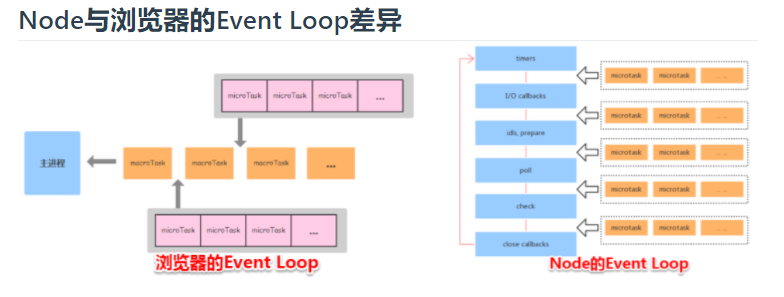

## EventLoop
https://www.taopoppy.cn/node/one_eventLoop.html#process-nexttick

### 什么是EventLoop
当js引擎遇到一个异步事件后，其实$\color{red}不会等到异步事件的返回$，而是先将异步事件进行$\color{red}挂起$。等到异步事件执行完毕后，会被加入到$\color{red}事件队列$中。（注意，此时只是异步事件执行完成，其中的回调函数并没有去执行。）当执行队列执行完毕，主线程处于闲置状态时，会去异步队列那抽取最先被推入队列中的异步事件，放入执行栈中，执行其中的回调同步代码。如此反复，这样就形成了一个无限的循环。这就是这个过程被称为事件循环（Event Loop）的原因.

$\color{red}步骤：$
1. 执行完主线程中的任务也就是第一个宏任务（macro-task），例如script任务
2. 从micro-task队列取出micro-task中任务执行直到清空
3. 取出macro-task中一个任务执行
4. 从micro-task队列取出micro-task中任务执行直到清空
5. 重复步骤3和4




### 宏任务
**当前调用栈中执行的代码成为宏任务。(主代码快,定时器等等).**

|       宏任务类型        | 浏览器 | NodeJs |  作用  |
| :---------------------: | :----: | :----: | :----: |
|          I/O ?          |   ✔    |   ✔    |   ?    |
|      UI rendering       |   ✔    |   ✖    |        |
|       setTimeout        |   ✔    |   ✔    | 定时器 |
|       setInterval       |   ✔    |   ✔    | 定时器 |
|      setImmediate       |   ✖    |   ✔    |   ?    |
| requestAnimationFrame ? |   ✔    |   ✖    |   ?    |


### 微任务
**当前（此次事件循环中）宏任务执行完，在下一个宏任务开始之前需要执行的任务,可以理解为回调事件。（promise.then，proness.nextTick等等）**
|        微任务类型         | 浏览器 | NodeJs |              作用               |
| :-----------------------: | :----: | :----: | :-----------------------------: |
|    process.nextTick ?     |   ✖    |   ✔    |                ?                |
|     MutationObserver      |   ✔    |   ✖    | 提供了监视对DOM树所做更改的能力 |
| Promise.then catch finaly |   ✔    |   ✔    |               --                |

```process.nextTick``` 大于 ```Promise```


### node时间循环
每个循环的顺序：
1. timer （定时器callback）
2. I/O （fs等callback）
3. idls, prepare (node内部执行，无法调用)
4. poll （获取新的I/O事件）
5. check （执行 setImmediate() 的回调）
6. close callback （执行 socket 的 close 事件回调）

$\color{red}每个阶段执行完成后会清空$micro-task队列  
$\color{red}在node环境中$process.nextTick优先级大于Promise


### 测试
```js
console.log(1)

setTimeout(() => {
	console.log(2)
	new Promise(resolve => {
			console.log(4)
			resolve()
	}).then(() => {
			console.log(5)
	})
	process.nextTick(() => {
			console.log(3)
	})
})

new Promise(resolve => {
    console.log(7)
    resolve()
}).then(() => {
    console.log(8)
})

process.nextTick(() => {
    console.log(6)
})

setTimeout(() => {
    console.log(9)
    process.nextTick(() => {
        console.log(10)
    })
    new Promise(resolve => {
        console.log(11)
        resolve()
    }).then(() => {
        console.log(12)
    })
})

```

## node和浏览器中执行的区别

定时器指定的时间也不是准确时间，只能是尽快执行

```js
setTimeout(()=>{
	console.log('timer1')
	Promise.resolve().then(function() {
		console.log('promise1')
	})
}, 0)
setTimeout(()=>{
	console.log('timer2')
	Promise.resolve().then(function() {
		console.log('promise2')
	})
}, 0)
setTimeout(()=>{
	console.log('timer3')
	Promise.resolve().then(function() {
		console.log('promise3')
	})
}, 5)

// 浏览器和node11版本以上输出：timer1 promise1 timer2 promise2 
// 低于node11版本输出：timer1 timer2 promise1 promise2
// 经过测试， 大于5毫秒可以稳定输出： timer1 promise1 timer2 promise2
```

低于node11版本，$\color{red}要看第一个定时器执行完，第二个定时器是否在完成队列中（是否完成）$; 上面2个定时器都是0秒（可以看作都完成？），所以输出：  
``` timer1 timer2 promise1 promise2 ```

