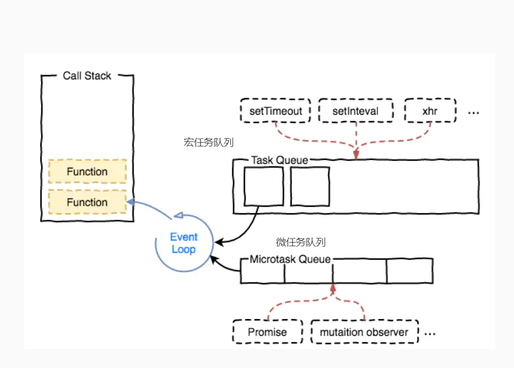

## Event Loop
event loop
当js引擎遇到一个异步事件后，其实不会等到异步事件的返回，而是先将异步事件进行挂起。等到异步事件执行完毕后，会被加入到事件队列中。（注意，此时只是异步事件执行完成，其中的回调函数并没有去执行。）当执行队列执行完毕，主线程处于闲置状态时，会去异步队列那抽取最先被推入队列中的异步事件，放入执行栈中，执行其中的回调同步代码。如此反复，这样就形成了一个无限的循环。这就是这个过程被称为“事件循环（Event Loop）”的原因.



### 宏任务```Task```和微任务```Microtask```

这两个概念属于对异步任务的分类，不同的API注册的异步任务会依次进入自身对应的队列中，然后等待Event Loop将它们依次压入执行栈中执行.

task主要包含：```setTimeout```、```setInterval```、```setImmediate```、```I/O```、```UI交互事件```  
microtask主要包含：```Promise```、```process.nextTick```、```MutaionObserver```

### 宏任务
**当前调用栈中执行的代码成为宏任务。(主代码快,定时器等等).**

|       宏任务类型        | 浏览器 | NodeJs |  作用  |
| :---------------------: | :----: | :----: | :----: |
|          I/O ?          |   ✔    |   ✔    |   ?    |
|      UI rendering       |   ✔    |   ✖    |        |
|       setTimeout        |   ✔    |   ✔    | 定时器 |
|       setInterval       |   ✔    |   ✔    | 定时器 |
|      setImmediate       |   ✖    |   ✔    |   ?    |
| requestAnimationFrame ? |   ✔    |   ✖    |   ?    |


### 微任务
**当前（此次事件循环中）宏任务执行完，在下一个宏任务开始之前需要执行的任务,可以理解为回调事件。（promise.then，proness.nextTick等等）**
|        微任务类型         | 浏览器 | NodeJs |              作用               |
| :-----------------------: | :----: | :----: | :-----------------------------: |
|    process.nextTick ?     |   ✖    |   ✔    |                ?                |
|     MutationObserver      |   ✔    |   ✖    | 提供了监视对DOM树所做更改的能力 |
| Promise.then catch finaly |   ✔    |   ✔    |               --                |

```process.nextTick``` 大于 ```Promise```

### 测试
```js
console.log(1)

setTimeout(() => {
    console.log(2)
    new Promise(resolve => {
        console.log(4)
        resolve()
    }).then(() => {
        console.log(5)
    })
    process.nextTick(() => {
        console.log(3)
    })
})

new Promise(resolve => {
    console.log(7)
    resolve()
}).then(() => {
    console.log(8)
})

process.nextTick(() => {
    console.log(6)
})

setTimeout(() => {
    console.log(9)
    process.nextTick(() => {
        console.log(10)
    })
    new Promise(resolve => {
        console.log(11)
        resolve()
    }).then(() => {
        console.log(12)
    })
}


// ```chrome```中输出: 1 7 6 8 2 4 9 11 3 10 5 12
// ```node```中输出:  1 7 6 8 2 4 3 5 9 11 10 12
// 分析: node环境中microtask会优先执行(及清空microtask队列); chrome则不会, 按照顺序执行
```

执行顺序: 主线程任务完成 ===> 清空微任务队列 ===> 执行一个宏任务 ===> 清空微任务队列 ===>  执行一个宏任务 ===> ... 