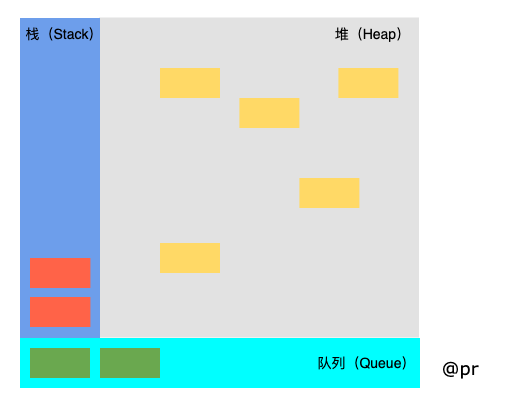
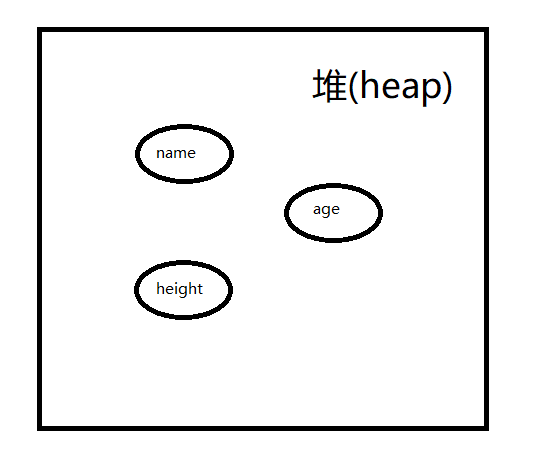
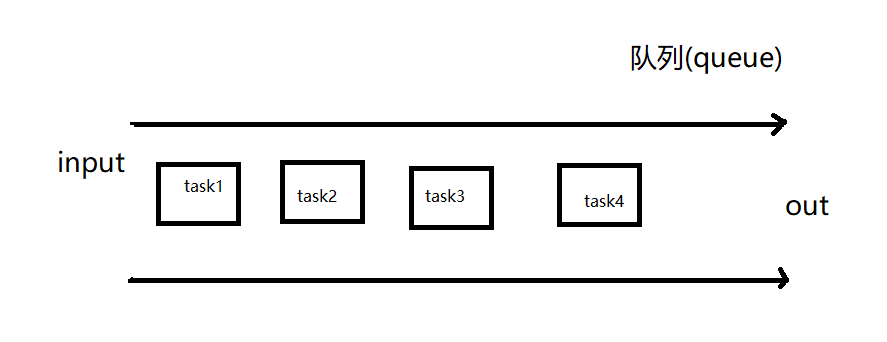
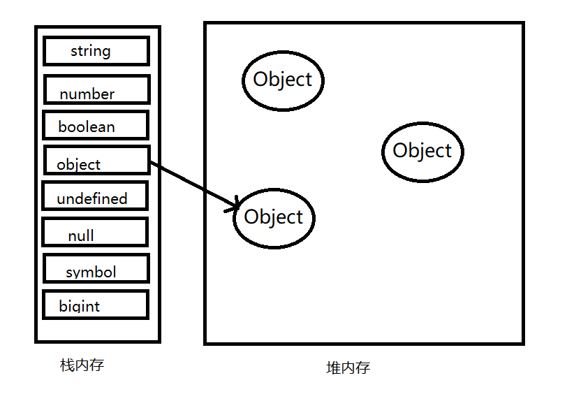

# 内存空间

## 三种数据结构

### 栈数据结构
**特点:** LIFO

这里所说的进栈和出栈不是指赋值算进, 使用算出. 而是指==赋值算进, 被清理算出==, 而且位于同一函数作用域下的变量, 应该是在栈的同一层.

???  
所谓的变量存储于栈内存中的栈，传统意义上说指的是由内存自动创建分配的空间，例如函数的参数值与局部变量，只是其操作方式类似于栈操作，所以叫栈内存

### 堆数据结构


一种树状结构。好比```JSON```格式中的数据，你有```key```，我有对应的```value```, 就立马返给你。

因为我们知道```JSON```格式的存储是无序的, 所以没有先后顺序, 所以它是一种绝对公平的数据结构.

### 队列数据结构


队列数据结构不同于堆, 队列是一种 **先进先出(FIFO)** 的数据结构.

它也是 **事件循环(Event Loop)** 的基础结构.

## 变量的存放
* 基本数据类型保存在栈内存中(寻值获取).
* 引用数据类型保存在堆内存中(寻址获取).



> 在计算机的数据结构中，栈比堆的运算速度快，Object是一个复杂的结构且可以扩展：数组可扩充，对象可添加属性，都可以增删改查。将他们放在堆中是为了不影响栈的效率。而是通过引用的方式查找到堆中的实际对象再进行操作。所以查找引用类型值的时候先去栈查找再去堆查找.

```js
var obj1 = { a: 1, b: 2 };
var obj2 = obj1;
obj2.a = 3;
console.log(obj1.a); // obj1.a = ?

var a = 1;
var b = a;
b = 2;
console.log(a); // a = ?

var obj3 = { a: 1 };
var obj4 = obj3;
obj3 = null;
console.log(obj4); // obj2 = ?
```

## 内存空间管理
内存空间也是有属于自己的生命周期, 它主要分为三个阶段:
1. 分配你所需的内存;
2. 使用分配到的内存(读、写);
3. 不需要的时候将其释放、归还.

### 什么是垃圾？
没有被引用的对象就是垃圾， 需要被清除

```js
var a = 1; // 在内存中给数值变量分配空间
alart(a + 2); // 使用内存
a = null; // 使用完后, 释放内存空间
```

上面三步分别对应着三个阶段. 当然```a = null```这个操作是我们手动将```a```的内存空间释放. 若没有这个过程, ```JS```会自己帮我做一些释放内存的工作吗? 答案当然是肯定的.

```JS```有自动垃圾收集机制, 它会找出那些不再继续使用的值，然后释放其占用的内存。垃圾收集器会每隔固定的时间段就执行一次释放操作。

在自动垃圾收集机制中, 最常用的就是通过```标记-清除```的算法来找到哪些对象不再继续使用. 其实上面我说的将```a = null```手动释放内存其实是**不准确**的. 因为使用```a = null```仅仅只是做了一个**释放引用**的操作, 让```a```原本对应的值失去引用, 脱离执行环境, 这个值会在下一次垃圾收集器执行操作的时候被找到并释放.

还有一点, 在局部作用域中, 当函数执行完毕了之后, 局部变量就没有存在下去的必要了, 此时垃圾收集器知道这类变量是需要回收的, 所以很容易判断.

但是全局变量什么时候需要释放内存空间则很难判断，因此在我们的开发中，原则上应该避免使用全局变量。

