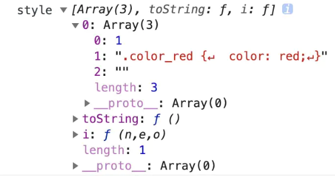

https://segmentfault.com/a/1190000015088834

## webpack是什么？
webpack 是一个现代 JavaScript 应用程序的静态模块打包器(module bundler)。

## 工作原理
Webpack 的运行流程是一个串行的过程，从启动到结束会依次执行以下流程：

1. 初始化参数：从配置文件和 Shell 语句中读取与合并参数，得出最终的参数；
2. 开始编译：用上一步得到的参数初始化 Compiler 对象，加载所有配置的插件，执行对象的 run 方法开始执行编译；
3. 确定入口：根据配置中的 entry 找出所有的入口文件；
4. 编译模块：从入口文件出发，调用所有配置的 Loader 对模块进行翻译，再找出该模块依赖的模块，再递归本步骤直到所有入口依赖的文件都经过了本步骤的处理；
5. 完成模块编译：在经过第4步使用 Loader 翻译完所有模块后，得到了每个模块被翻译后的最终内容以及它们之间的依赖关系；
6. 输出资源：根据入口和模块之间的依赖关系，组装成一个个包含多个模块的 Chunk，再把每个 Chunk 转换成一个单独的文件加入到输出列表，这步是可以修改输出内容的最后机会；
7. 输出完成：在确定好输出内容后，根据配置确定输出的路径和文件名，把文件内容写入到文件系统。

## loader和plugin的区别
loader是一个转换器， loader可以将所有类型的文件转换为webpack能够处理的有效模块  
plugin是扩展器， 针对是loader结束后，webpack打包的整个过程，它并不直接操作文件，而是基于事件机制工作，会监听webpack打包过程中的某些节点，执行广泛的任务。

## 安装
生成```package.json```
```
npm init
```
安装```webpack```
```
npm install webpack --save-dev
npm install webpack-cli --save-dev
```

打包demo文件目录
```
demo
  | - package.json
  | - /dist
    | - main.js
  | - /app
    | - main.js
    | - Greeter.js
  | - /public
    | - index.html
```
**index. html**
```
<!DOCTYPE html>
<html lang="en">
  <head>
    <meta charset="utf-8">
    <title>Webpack Sample Project</title>
  </head>
  <body>
    <div id='root'>
    </div>
    <script src="bundle.js"></script>
  </body>
</html>
```

**Greeter.js**
```
module.exports = function() {
  var greet = document.createElement('div');
  greet.textContent = "Hi there and greetings!";
  return greet;
};
```

**main.js**
```
const greeter = require('./Greeter.js');
document.querySelector("#root").appendChild(greeter());
```

## 使用
```
# 全局安装webpack后, entry file是入口文件
webpack {entry file}

# 非全局安装
node_modules/.bin/webpack {entry file}

# 使用npx(npx运行时, 会到node_modules/.bin路径和环境变量$PATH检查命令是否存在)
npx webpack {entry file}
```

## 通过配置使用
在项目根目录下创建```webpack.config.js```
```
module.exports = {
  entry:  __dirname + "/app/main.js",//已多次提及的唯一入口文件
  output: {
    path: __dirname + "/public",//打包后的文件存放的地方
    filename: "bundle.js"//打包后输出文件的文件名
  }
}
```
然后直接执行```webpack```

## 更快捷的执行打包任务
在```package.json```中进行配置
```
{
  "name": "webpack-sample-project",
  "version": "1.0.0",
  "description": "Sample webpack project",
  "scripts": {
    "start": "" 
    "my-build": "webpack"// 修改的是这里，JSON文件不支持注释，引用时请清除
  },
  "author": "zhang",
  "license": "ISC",
  "devDependencies": {
    "webpack": "3.10.0"
  }
}
```

## webpack功能

### 生成Source Maps（使调试更容易）
|         devtool选项          |                                                                                                                     配置结果                                                                                                                      |
| :--------------------------: | :-----------------------------------------------------------------------------------------------------------------------------------------------------------------------------------------------------------------------------------------------: |
|          source-map          |                                                                       在一个单独的文件中产生一个完整且功能完全的文件。这个文件具有最好的source map，但是它会减慢打包速度；                                                                        |
|   cheap-module-source-map    |                                         在一个单独的文件中生成一个不带列映射的map，不带列映射提高了打包速度，但是也使得浏览器开发者工具只能对应到具体的行，不能对应到具体的列（符号），会对调试造成不便；                                         |
|       eval-source-map        | 使用eval打包源文件模块，在同一个文件中生成干净的完整的source map。这个选项可以在不影响构建速度的前提下生成完整的sourcemap，但是对打包后输出的JS文件的执行具有性能和安全的隐患。在开发阶段这是一个非常好的选项，在生产阶段则一定不要启用这个选项； |
| cheap-module-eval-source-map |                                                这是在打包文件时最快的生成source map的方法，生成的Source Map 会和打包后的JavaScript文件同行显示，没有列映射，和eval-source-map选项具有相似的缺点；                                                 |
配置如下:
```
module.exports = {
  devtool: 'eval-source-map',
  entry:  __dirname + "/app/main.js",
  output: {
  }
}
```


### 使用webpack构建本地服务器
**作用:** 让浏览器监听代码的修改，并自动刷新显示修改后的结果
**安装:**
```
npm install webpack-dev-server --save-dev
```

| devserver的配置选项 |                                                        功能描述                                                        |
| :-----------------: | :--------------------------------------------------------------------------------------------------------------------: |
|     contentBase     | 默认webpack-dev-server会为根文件夹提供本地服务器，如果想为另外一个目录下的文件提供本地服务器，应该在这里设置其所在目录 |
|        port         |                                         设置默认监听端口，如果省略，默认为8080                                         |
|       inline        |                                        设置为true，当源文件改变时会自动刷新页面                                        |
| historyApiFallback  |            在开发单页应用时非常有用，它依赖于HTML5 history API，如果设置为true，所有的跳转将指向index.html             |
配置如下:
```
module.exports = {
  devtool: 'eval-source-map',
  entry:  __dirname + "/app/main.js",
  output: {},
  devServer: {
    contentBase: "./public",//本地服务器所加载的页面所在的目录
    historyApiFallback: true,//不跳转
    inline: true//实时刷新
  } 
}
```

### loader
loader 让 webpack 能够去处理那些非 JavaScript 文件（webpack 自身只理解 JavaScript）。loader 可以将所有类型的文件转换为 webpack 能够处理的有效模块，然后你就可以利用 webpack 的打包能力，对它们进行处理。

本质上，webpack loader 将所有类型的文件，转换为应用程序的依赖图（和最终的 bundle）可以直接引用的模块。

配置如下：
```js
// test和use
let baseConfig = {
  entry: __dirname + '/app/main.js,
  output: {
    path: __dirname + '/dist',
    filename: 'bundle.js'
  },
  devtool: ...,
  module: {
    rules: [
      {
        test: /\.css$/
        use: [
          {loader: "style-loader"},
          {loader: "css-loader"}
        ]
      },
      {
        test: /\.less$/,
        use: [
          {loader: 'style-loader'},
          {loader: 'css-loader'},
          {loader: 'less-loader'}
        ],
        exclude: /node_modules/
      }...
    ]
  }
}
```
### babel
Babel其实是一个编译JavaScript的平台，它可以编译代码帮你达到以下目的：

* 让你能使用最新的JavaScript代码（ES6，ES7...），而不用管新标准是否被当前使用的浏览器完全支持；
* 让你能使用基于JavaScript进行了拓展的语言，比如React的JSX

### plugins
插件是 webpack 的**支柱**功能。webpack 自身也是构建于，你在 webpack 配置中用到的相同的插件系统之上！

插件目的在于解决 loader 无法实现的其他事。

#### 自定义一个plugin
```js
class myPlugins {
  constructor (options) {
    this.options = options || {}
    this.filename = this.options.filename || 'fileList.md'
  }

  apply (compiler) {
    compiler.hooks.emit.tapAsync('myPlugins', (compliation, cb) => {
      setTimeout(() => {
        const fileListName = this.filename
        const len = Object.keys(compliation.assets).length
        let content = `# 一共有${len}个文件\n\n`
        for (let filename in compliation.assets) {
          content += `- ${filename}\n`
        }
        compliation.assets[fileListName] = {
          source () {
            return content
          },
          size () {
            return content.length
          }
        }
        cb()
      }, 2000)
    })
  }
}
module.exports = myPlugins

```

使用plugin
```
var myPlugins = require('./myPlugins')
var lessRules = {
    use: [
        {loader: 'css-loader'},
        {loader: 'less-loader'}
    ]
}

var baseConfig = {
  // ... 
  module: {
    rules: [
      // ...
      {test: /\.less$/, use: ExtractTextPlugin.extract(lessRules)}
    ]
  },
  plugins: [
    new myPlugins()
  ]
}
```
1. HtmlWebpackPlugin
2. clean-webpack-plugin

## 管理资源
### 1. 加载css
使用```style-loader```和```css-loader```

```css-loader```作用识别导入的css这个模块，并通过特定的语法规则进行内容转换
```
// test.css
.color_red {
  color: red;
}
```
使用```css-loader```后:



```style-loader```它的原理其实就是通过一个JS脚本创建一个style标签，里面会包含一些样式。并且它是不能单独使用的，因为它并不负责解析css之前的依赖关系。

也就是说：

* 单独使用了css-loader只能保证我们能引用css模块进来，但是并没有效果
* 而style-loader就可以创建一个style标签，并且把引入进来的css样式都塞到这个标签里


### 加载图片
```
{
    test: /\.(png|svg|jpg|gif)$/,
    use: {
        loader: "file-loader",
        options: {
          name: "[name].[ext]",
          outputPath: "images/",
        },
      },
}
```
name的[name]表示使用文件的原始名称, [ext]表示文件的原始类型, [hash]表示以哈希值命名, [path]表示资源相对于context的路径.