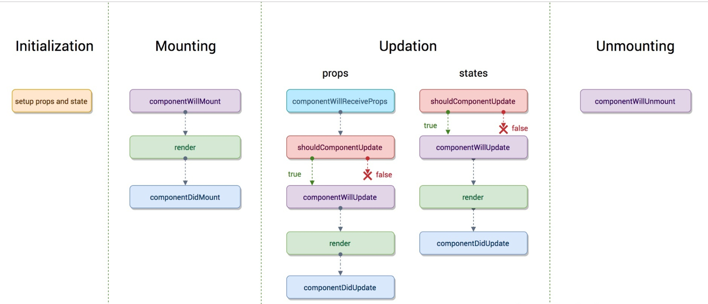
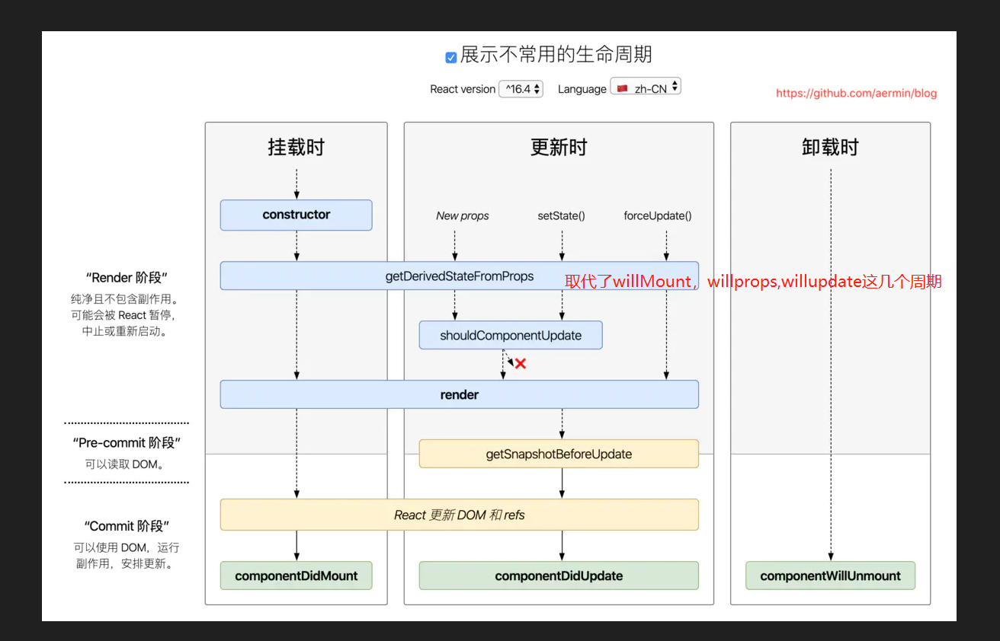

# React

## React 和 ReactDOM

> React 只做逻辑层, ReactDOM 去渲染真实的 DOM

```js
import React from "react";
import ReactDOM from "react-dom";
// 任意组件
import App from "./App.jsx";

// index.html 对应dom节点
ReactDOM.render(<App />, document.querySelector("#root"));
```

## state

> 组件状态

### 设置 state

```js
class Test extends React.Component {
  // 非必要
  constructor(props) {
    super(props);
    // 设置state
    this.state = {
      data: null,
    };
  }

  // 必要
  render() {
    return <div>kiana</div>;
  }
}
```

## 组件通信

- 父组件向子组件通信(props)
- 子组件向父组件通信(传递回调函数)
- 跨级组件通信(Provider, Consumer)
- 没有嵌套关系组件之间的通信(emit)

### 跨级组件通信

```js
// 父组件
import React from 'react'

import ChildTest from './'

const {Consumer, Provider} = React.createContext({name: null})

class Test extends React.Component {
  // 非必要
  constructor (props) {
    super(props)
    // 设置state
    this.state = {
      name: null
    }
  }

  // 必要
  render () {
    return (
      <Provider value={name: 'rita'}>
        <ChildTest />
      </Provider>
    )
  }
}

export {
  Test,
  Consumer
}
// --------------------------------------------------
// 子组件

import {Consumer} from './父组件'

let context = React.createContext({name: null})

class Test extends React.Component {
  // 非必要
  constructor (props) {
    super(props)
    // 设置state
    this.state = {
      name: null
    }
  }

  // 必要
  render () {
    return (
      <Consumerr >
        {
          value => (
            <div>{value.name}</div>
          )
        }
      </Consumer>
    )
  }
}
```

### 没有嵌套关系组件之间的通信

```js
// react Events
import { EventEmitter } from "events";

const Emitter = new EventEmitter();

// 订阅
Emitter.addListener("my-event", (param) => {
  // ......
});

// 发布
Emitter.emit("my-event", 123);
```

## ref 和 refs

在 React 中,类似于 Vue,可以通过`ref`标记元素,然后通过`this.refs`获取元素,只是 Vue 中使用的是`this.$refs`获取元素

### 字符串写法

通过设置一个字符串值来标记元素,然后通过这个字符串作为属性获取元素

```js
class Input extends Component {
  handleChange = (e) => {
    console.log(this.refs.a.value);
  };
  render() {
    return (
      <div>
        <input type="text" ref="a" onChange={this.handleChange} />
      </div>
    );
  }
}
```

### 函数写法

函数作为一个 ref 的属性值,这个函数接受一个参数,就是真实的 DOM 元素

可以把这个元素挂载到实例上,方便后面的操作

```js
class Input extends React.Component {
  componentDidMount() {
    console.log(this.a); //获取真实的DOM元素
  }
  render() {
    return (
      <div>
        <input type="text" ref={(x) => (this.a = x)} />
      </div>
    );
  }
}
```

## react 生命周期

`getDerivedFromProps(慎用, 使用较少)`  
将 props 映射到 state 上(可以用于判断是否更新 state)

```js
getDerivedStateFormProps (nextProps, prevState) {
  if (nextProps !== prevState) {
    return nextProps
  }
  // 不改变state
  return null
}
```

`shouldComponentUpdate(使用较少)`  
会在渲染执行之前被调用. 可以用于判断是否进行 render, 返回值默认为 true.

```js
shouldComponentUpdate (nextProps, nextState, nextContext) {
  // 返回值为boolean, 决定是否进行render
  return true
}
```

`getSnapshotBeforeUpdate`  
在最近一次的 render 完将要 commit 给 DOM 的时候会调用，这个方法能够使得组件可以在可能更改之前从 DOM 捕获一些信息，比如滚动的位置等等。这个方法返回的任何值，都会传递给` componentDidUpdate(nextProps, nextState, snapshot)`。  
这个方法一般来说是不会使用的，不过它可能会出现在需要以特殊方式进行处理 UI，比如像是聊天线程中处理滚动位置。

```js

getSnapshotBeforeUpdate(prevProps, prevState) {
  // 捕获滚动的位置，以便后面进行滚动 注意返回的值
  if (prevProps.list.length < this.props.list.length) {
    const list = this.listRef.current;
    return list.scrollHeight - list.scrollTop;
  }
  // componentDidUpdate 第三个参数接收
  return null;
}

componentDidUpdate(prevProps, prevState, snapshot) {
  // 如果有 snapshot 会进行滚动的调整，这样子就不会立即将之前的内容直接弹上去
  if (snapshot !== null) {
    const list = this.listRef.current;
    list.scrollTop = list.scrollHeight - snapshot;
  }
}
```

```componentDidUpdate```
如果你需要执行副作用（例如，数据提取或动画）以响应 props 中的更改

``` componentDidMount```

```componentWillUnmount```






## react-router

```jsx
import { withRouter, BrowserRouter as Router } from "react-router-dom";

const _component = (props) => {
  return <div>_component</div>;
};

// withRouter需要放在<Router>里面
export default withRouter(_component);
```

## react 合成事件

> 是 React 模拟原生 DOM 事件所有能力的一个事件对象

其主要有三个目的:

- 进行浏览器兼容(将不同平台事件模拟合成事件)，实现更好的跨平台
- 避免垃圾回收
- 方便事件统一管理和事务机制
