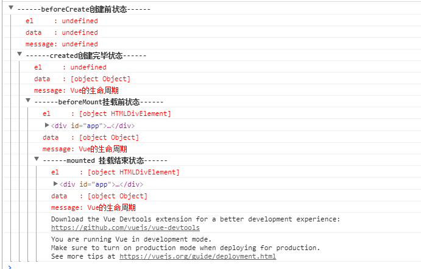
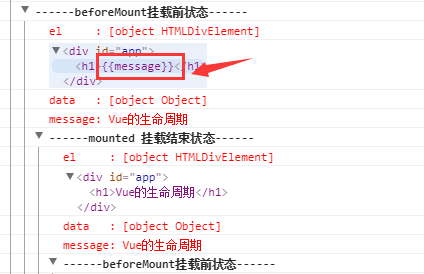

https://github.com/LinDaiDai/niubility-coding-js/blob/master/%E6%A1%86%E6%9E%B6-%E5%BA%93/Vue/Vue%E9%9D%A2%E8%AF%95%E9%A2%98%E6%95%B4%E7%90%86.md


https://juejin.im/post/5c6621565188256220140756
## 概述
* MVVM的理解


## 对于MVVM的理解
**MVVM** 是 **Model-View-ViewModel** 缩写，也就是把 **MVC** 中的 **Controller**演变成 **ViewModel**. **Model** 层代表数据模型,**View** 代表UI组件, **ViewModel** 监听模型数据的改变和控制视图行为、处理用户交互，简单理解就是一个同步**View** 和 **Model** 的对象，连接 **Model** 和 **View**，我们可以不需要关注DOM，只关注业务逻辑。

```js
// MVVM
// @param options , elenent就是view, data就是model
let vm = new MVVM({element, data})
```


存在疑惑: 
1. 为什么Dep.target = this 而不用一个全局变量保存?
2. 为什么每次defineReactive调用都要创建一个新的dep, 这样做每个订阅数据的getter和setter都引用独立的dep, 会不会造成资源浪费? 可以在全局创建一个dep吗?


## Vue生命周期

```beforeCreate```是```new Vue()```之后触发的第一个钩子，在当前阶段data、methods、computed以及watch上的数据和方法都不能被访问。

```created```在实例创建完成后发生，当前阶段已经完成了数据观测，也就是可以使用数据，更改数据，在这里更改数据不会触发```updated```函数。可以做一些初始数据的获取，在当前阶段无法与Dom进行交互，如果非要想，可以通过```vm.$nextTick```来访问Dom。


```beforeMount```发生在挂载之前，在这之前template模板已经被编译成了render function。而当前阶段虚拟Dom已经创建完成，即将开始渲染。在此时也可以对数据进行更改，不会触发updated。

```mounted```在挂载完成后发生，在当前阶段，真实的Dom挂载完毕，数据完成双向绑定，可以访问到Dom节点，使用$refs属性对Dom进行操作。一般可以在这个阶段进行Ajax请求，但需要注意的是服务端渲染时不支持mounted，需要放到created中。

```beforeUpdate```发生在更新之前，也就是响应式数据发生更新，虚拟dom重新渲染之前被触发，你可以在当前阶段进行更改数据，不会造成重渲染。

```updated```发生在更新完成之后，当前阶段组件Dom已完成更新。要注意的是避免在此期间更改数据，因为这可能会导致无限循环的更新。

```beforeDestroy```发生在实例销毁之前，在当前阶段实例完全可以被使用，我们可以在这时进行善后收尾工作，比如清除计时器。

```destroyed```发生在实例销毁之后，这个时候只剩下了dom空壳。组件已被拆解，数据绑定被卸除，监听被移出，子实例也统统被销毁。

##　再说一下vue2.x中如何监测数组变化
(数组数据变化不是响应式的)使用了函数劫持的方式，重写了数组的方法，Vue将data中的数组进行了原型链重写，指向了自己定义的数组原型方法。这样当调用数组api时，可以通知依赖更新。如果数组中包含着引用类型，会对数组中的引用类型再次递归遍历进行监控。这样就实现了监测数组变化。

## nextTick知道吗，实现原理是什么？

nextTick批量异步更新策略，一句话概括在下次DOM更新循环结束之后执行延迟回调。它主要是为了解决：例如一个data中的数据它的改变会导致视图的更新，而在某一个很短的时间被改变了很多次，假如是1000次，每一次的改变如果都将促发数据中的setter并按流程跑下来直到修改真实DOM，那DOM就会被更新1000次，这样的做法肯定是非常低效的。

### 实现原理


第一个 tick(图例中第一个步骤，即'本次更新循环'):

   1. **首先修改数据，这是同步任务**. 同一事件循环的所有的同步任务都在主线程上执行，形成一个执行栈，此时还未涉及 DOM. ( **不同事件循环是指 赋值后 触发到setter, getter这种吗?** )  
   2. **Vue 开启一个异步队列，并缓冲在此事件循环中发生的所有数据改变. 如果同一个 watcher 被多次触发，只会被推入到队列中一次** (同步代码执行完之前).

第二个 tick图例中第二个步骤，即'下次更新循环'):

**同步任务执行完毕，开始执行异步 watcher 队列的任务，更新 DOM** .Vue 在内部尝试对异步队列使用原生的 Promise.then 和 MessageChannel 方法，如果执行环境不支持，会采用 setTimeout(fn, 0) 代替.

第三个 tick(图例中第三个步骤): 如图所示

## 再说一下Computed和Watch
```Computed```本质是一个具备缓存的watcher，依赖的属性发生变化就会执行回调。 ==适用于一些比较消耗性能的复杂计算或者是一些需要被频繁调用的计算。因为当表达式过于复杂时==，在模板中放入过多逻辑会让模板难以维护，可以将复杂的逻辑放入计算属性中处理。

```Watch```没有缓存性，更多的是观察的作用，可以监听某些数据执行回调。当我们需要深度监听对象中的属性时，可以打开deep：true选项，这样便会对对象中的每一项属性进行监听。但是这样会带来性能问题，优化的话可以使用字符串形式监听，如果没有写到组件中，也就是使用```vm.$watch```来设置监听的时候，这个```vm.$watch```是会返回一个取消观察函数，调用这个函数就可以手动注销监听了。


## 11.组件中的data为什么是一个函数？
一个组件被复用多次的话，也就会创建多个实例。本质上，这些实例用的都是同一个构造函数。如果data是对象的话，对象属于引用类型，会影响到所有的实例。==所以为了保证组件不同的实例之间data不冲突，data必须是一个函数。==

## 12.说一下v-model的原理
v-model本质就是一个语法糖，可以看成是:value + v-on方法的语法糖。 可以通过model属性的prop和event属性来进行自定义。原生的v-model，会根据标签的不同生成不同的事件和属性。

* text 和 textarea 元素使用 value 属性和 input 事件；
* checkbox 和 radio 使用 checked 属性和 change 事件；
* select 字段将 value 作为 prop 并将 change 作为事件。

## 13. Vue不能检测数组和对象的什么操作，如何解决？
不能检测变动操作，使用vue.$set()
```js
this.$set(this.items, index, test) // 数组方法
this.$set(this.items, 'age', 12) // 对象
```

## 14. vue.$nextTick何时使用？
> 在下次 DOM 更新循环结束之后执行延迟回调。在修改数据之后立即使用这个方法，获取更新后的 DOM。

1. 在Vue生命周期的created()钩子函数进行的DOM操作一定要放在Vue.nextTick()的回调函数中
2. 在数据变化后要执行的某个操作，当你设置 vm.someData = 'new value'，DOM并不会马上更新，而是在异步队列被清除，也就是下一个事件循环开始时执行更新时才会进行必要的DOM更新


## 15. 什么时候使用vuex？
1. 考虑如何更好地在组件外部管理状态的时候


