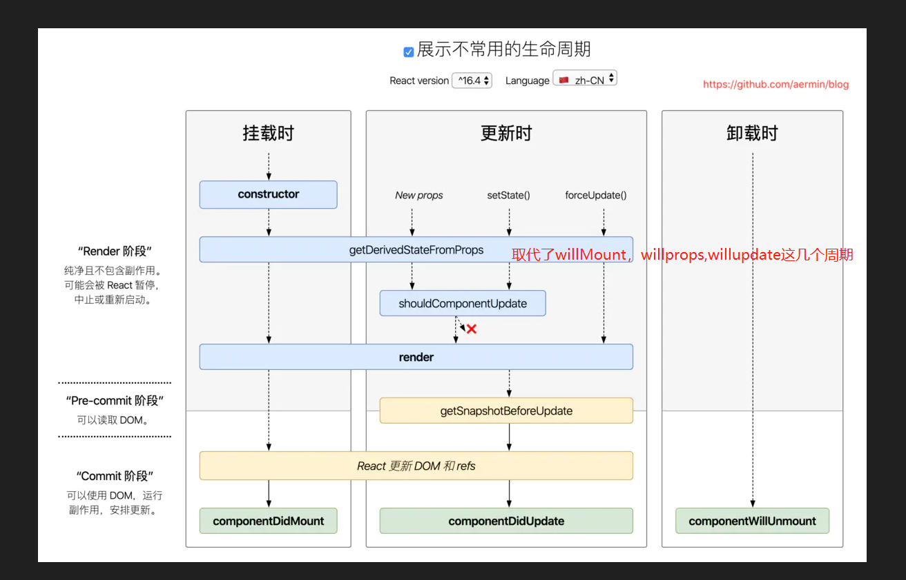

## 为什么用react
因为vue的机制，会给每个数据设置getter和setter，当数据量小的是一个便利的操作方式，当数据量大时，会影响加载时间

## react生命周期
``` static getDerivedFromProps  ```   
会在调用 render 方法之前$\color{red}调用$，并且在初始挂载及后续更新时都会被调用。它应返回一个对象来更新 state，如果返回 null 则不更新任何内容

<br>

``` shouldComponentUpdate ```  
会在渲染执行之前被调用。返回值默认为 true

<br>

``` componentDidUpdate ```
如果你需要执行副作用（例如，数据提取或动画）以响应 props 中的更改





