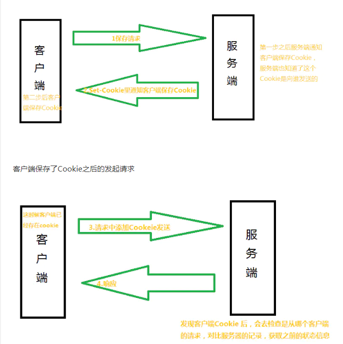
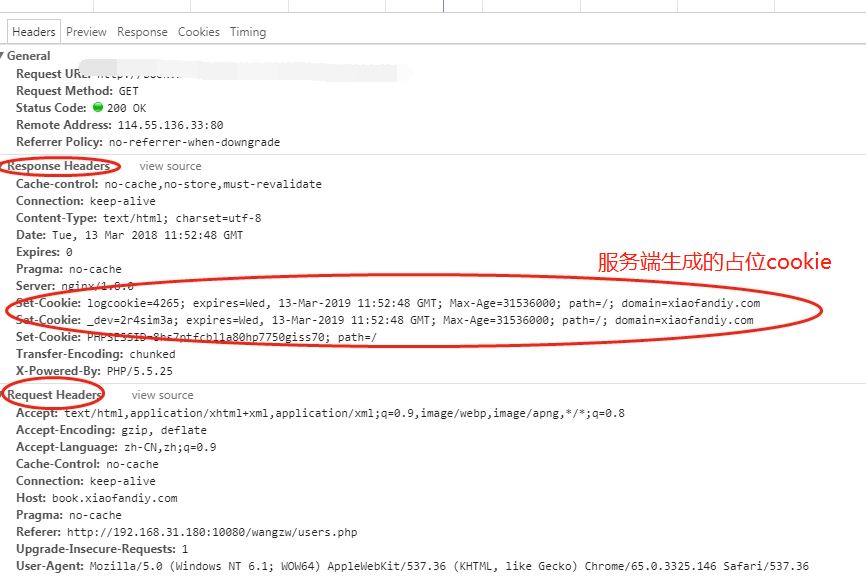
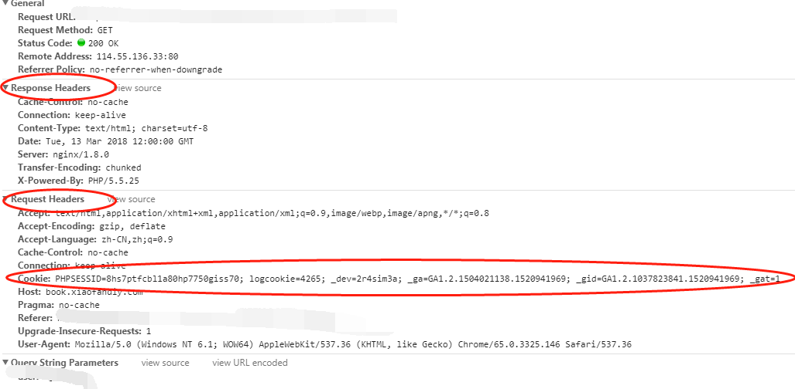
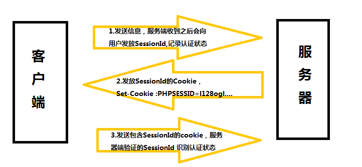

## cookie
### 什么是cookie
> Cookie是客户端保存用户信息的一种机制，用来记录用户的一些信息，实际上Cookie是服务器在本地机器上存储的一小段文本，并随着每次请求发送到服务器

**Cookie技术通过请求和响应报文中写入Cookie信息来控制客户端的状态**


**第一次**



**第二次** 


### set-Cookie的字段的$\color{red}属性$
* ```xxxname = xxx``` 设置cookie的名字和值
* ```expires``` 是设置cookie$\color{red}有效期$
* ```path``` 是限制指定Cookie 的发送范围的$\color{red}文件目录$。
* ```domain``` 通过domain属性$\color{red}指定的域名$可以做到与结尾匹配一致比如，指定domain是```fafa.com```，除了```fafa.com```那么```www.fafa.com```等都可以发送Cookie。
* ```secure``` 设置web页面只有在HTTPS$\color{red}安全连接$时，才可以发送Cookie
* ```HttpOnly``` 它使JavaScript 脚本$\color{red}无法获得$Cookie


## session

### 什么是session
上面我讲到$\color{red}{服务端执行session机制时候会生成session的id值}$，这个id值会发送给客户端，客户端每次请求都会把这个id值放到http请求的头部发送给服务端，而这个id值在客户端会保存下来，$\color{red}{保存的容器就是cookie}$，因此当我们完全禁掉浏览器的cookie的时候，服务端的session也会不能正常使用。 

PHP中的Session在默认情况下是使用客户端的Cookie来保存Session ID的，所以当客户端的cookie出现问题的时候就会影响Session了。必须注意的是：$\color{red}{Session不一定必须依赖Cookie}$，这也是Session相比Cookie的高明之处。当客户端的Cookie被禁用或出现问题时，PHP会自动把Session ID附着在URL中，这样再通过Session ID就能跨页使用Session变量了。




## Cookie与Session的区别
* ```cookie```数据存放在$\color{red}客户端$，```session```数据放在$\color{red}服务器$，但是服务端的```session```的实现对客户端的```cookie```有$\color{red}依赖关系$;
* cookie$\color{red}{不是很安全}$，别人可以分析存放在本地的COOKIE并进行COOKIE欺骗，$\color{red}{考虑到安全应当使用}$session;
* session会在一定时间内保存在服务器上。当访问增多，$\color{red}会比较占用你服务器的资源$。考虑到提高服务器性能方面，应当使用COOKIE;
* 单个cookie在客户端的限制是```3K```，就是说一个站点在客户端存放的COOKIE不能超过3K;
