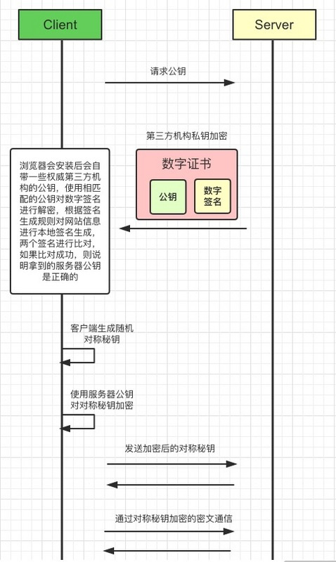

## 概述
* HTTP概述
* HTTP特点及缺点
* $\color{red}{HTTP请求方法}$
* $\color{red}{HTTP状态码}$

## HTTP概述
### 一句话概述HTTP
```HyperText Transfer Protocol```，$\color{red}{超文本传输协议}$  
HTTP是计算机里专门两点之间传输文字,图片,音频,视频等超文本数据的约定和规范;

### HTTP存在的位置
处于 TCP/IP 网络分层模型中的第一层应用层。

应用层的其它协议还有：

* FTP：文件传输协议，用来在客户机和FTP服务器之间传输文件。
* DNS域名系统：提供域名到IP地址之间的解析服务。
* SMTP：邮件发送协议，用户通过SMTP服务器发送邮件。
* DHCP：动态主机配置协议，DHCP服务器为客户机动态分配IP地址。
* POP3：邮件接收协议，用于从POP3服务器接收邮件。

前面三个记住就行

### HTTP1.0, HTTP1.1 和 HTTP2.0的区别
* 缓存处理 HTTP1.0 header里的```If-Modified-Since,Expires```,  HTTP1.1引入```Entity tag，If-Unmodified-Since, If-Match, If-None-Match```
* HTTP$\color{red}{协议头部压缩}$
* 性能的提升

<br><br><br><br>

## HTTP特点及缺点
### HTTP特点
常问知识点
* HTTP协议支持客户端/服务端模式，也是一种请求/响应模式的协议。
* 灵活可扩展：一个是语义上的自由，只规定了基本格式，其它的各部分没有严格的限制；第二个它允许传输任意类型的数据对象，例如文本、图片、音频等，传输的类型由Content-Type加以标记。
* 可靠传输，HTTP 基于 TCP/IP，因此把这一特性继承了下来。
* 无状态，也就是说HTTP请求不具备保存之前发送过的请求或响应的功能，每一次请求都是独立无关的。


如果还要的话，可以答一下持久连接：

* 概念：建立一次TCP连接即可进行多次请求或响应的交互
* 产生原因：HTTP的初始版本是每进行一次HTTP通信就要断开一次TCP连接，下次再进行的时候*又要重新连接断开。再如今请求的资源越来越大，每次请求如果都有无谓TCP连接和断开是很大的开销。
* 特点：只要有一方没有明确的提出断开连接，则保持TCP连接状态。
* 优点：减少了TCP连接和断开的造成的额外开销，减轻了服务端的负载，Web页面加载变快
* 注意点：在HTTP/1.1中所有的连接默认都是持久连接的(也就是首部字段 Connection: keep-alive，若是想要关闭则将值设置为 close)，但是HTTP/1.0并未标准化
（另外其实还有一个管线化的特点，同时并行发送多个请求，而不必等前一个请求完毕才能发送下一个。但是因为各种原因被各大厂商废弃了）

### 2.2 HTTP的缺点

简单来说：

* 明文传输(不加密)，内容可能被窃听。
* 无法验证报文的完整性，内容可能被篡改。
* 不验证通信方的身份，有可能遭遇伪装。
* 无状态，它是缺点也是优点吧，分不同的场景。
* 队头阻塞。


详细来说：

* 明文传输(不加密)，内容可能被窃听。协议里的报文不使用二进制数据，而是文本形式
* 无法验证报文的完整性，内容可能被篡改。这里说的完整性也就是指信息的准确度 因为接收方或者发送方没有办法确认对方发送过来的数据在中间有没有被篡改
* 不验证通信方的身份，有可能遭遇伪装。因为HTTP协议中不会对通信方进行确认 任何人都可以发送请求，而且服务器它对收到的请求也不会进行确认，只要收到了请求就会返回一个响应(当然这个只是在发送端的IP地址或者端口号没被Web服务器设定限制访问的前提下)
* 无状态，不具备保存之前发送过的请求或响应的功能。它是缺点也是优点吧：
对于一些长连接的场景需要保存上下文信息，以免传输重复的数据。
对于一些应用只是为了获取数据不需要保存上下文信息，无状态减少了网络开销。
* 队头阻塞：
  * 其根本原因在于HTTP是基于 请求-响应 的模型，在同一个TCP长连接中，前一个请求没有得到响应，后面的请求就会被阻塞。
  * 用并发连接 和 域名分片 来解决了这个问题。但并不是从HTTP本身的层面来解决的，只是增加了 TCP 连接，分摊风险而已。
  * HTTP/2中的多路复用从HTTP本身的层面解决了这个问题
  * 和TCP队头阻塞的区别：TCP传输的单位是数据包，它的队头阻塞表示的是前一个报文没有收到便不会将下一个报文上传给HTTP。而HTTP队头阻塞是在 请求-响应 层面，前一个请求还没有处理完，后面的请求就被阻塞。

<br><br><br><br>

## HTTP请求方法
### 方法种类
* GET：获取资源，幂等操作
* HEAD：获取报文首部，和GET很像但是不返回报文主体，幂等操作
* POST: 创建或更新资源，非幂等操作
* PUT: 创建或更新资源本身，幂等操作
* PATCH：对资源进行局部更新，幂等操作
* DELETE：删除资源，和PUT功能相反，幂等操作
* OPTIONS：查询服务器端支持的HTTP方法种类(幂等操作)：
* CONNECT：建立连接隧道，用于代理服务器，幂等操作
* TRACE：追踪请求，查询发出去的请求是怎样被加工/篡改的，幂等操作。容易引发XST跨站追踪攻击。

### ```GET``` 和 ```POST``` 区别
1. post更安全,数据放在请求中(不会作为url的一部分, 不会被缓存, 不会保存在服务器日志和浏览器记录中)
2. post发送的数据更大(url长度会被浏览器限制)
3. post能发送更多的数据类型如 Content-Type: text/xml, application/json, multipart/form-data，x-www-form-urlencoded等(get只能发送ASCII字符)
4. post用于修改和写入数据，get一般用查询，目的是资源的获取，读取数据
5. post比get更慢，get和post虽然本质都是tcp/ip，get会产生一个tcp数据包，post两个


<br><br><br><br>

## ```HTTP状态码```
### 1xx 信息性
服务器收到请求，需要请求者继续执行操作，但是HTTP/1.0 不支持。

* ```100``` Continue: 表示目前为止一切正常, 客户端应该继续请求
* 101 Switching Protocols: 在HTTP升级为WebSocket时，如果服务器同意变更，则返回 101。

### 2xx 成功状态
成功处理请求。

* ```200``` OK ：请求成功，通常返回的数据中带有响应体。
* ```204``` No Content：意思和200一样，不过返回的数据中不带有响应体。（只需要表示成功，减少不必要的数据传输）
  
### 3xx 重定向
重定向状态，资源位置发生变动，需要重新请求。

* ```301``` Moved Permanently：$\color{red}{永久重定向}$，最新的URI为响应报文首部的 Location 字段。场景是：例如你的网站换了地址了，之前的地址不用了，若用户还是从之前的地址进的话则会返回301且在Location中带上最新的URI。且浏览器默认会做缓存优化，减少服务器压力，在第二次访问的时候自动访问重定向的那个地址。
* ```302``` Found：$\color{red}{临时重定向}$，和301不同，它表示请求的资源临时被移动到了别的URI上，因为是暂时的，所以不会被缓存。
* ```304``` Not Modefied：说明无需再次传输请求的内容，也就是说可以使用缓存的内容

### 4xx 客户端错误
客户端出现错误。

* ```400 Bad Request``` $\color{red}{请求报文中存在语法错误。}$ 
* ```401 Unauthorized``` $\color{red}{缺少目标资源要求的身份认证凭证。}$ 
* ```403 Forbidden``` $\color{red}{请求资源被拒绝，原因是：比如法律禁止、信息敏感。}$
* ```404 Not Found``` $\color{red}{请求资源未找到。}$

### 5xx 服务端出现错误
服务端出现错误。

* ```500 Internal Server Error```：服务器内部错误，但是没有具体指出是哪里，和400有点像。
* 501 Not Implemented：表示客户端请求的功能还不支持
* 502 Bad GateWay：服务器自身是正常的，但是代理服务器无法获取到合法响应(点外卖时外卖小哥没送)
* ```503 Service Unavailable```：服务器内部处于超负载状态或进行停机维护(就像是本店今天不开张)


## HTTPS
HTTPS就是使用$\color{red}SSL/TLS协议$进行加密传输，让$\color{red}客户端拿到服务器的公钥$，然后客户端随机生成一个对称加密的秘钥，使用公钥加密，传输给服务端，后续的所有信息都通过该对称秘钥进行加密解密，完成整个HTTPS的流程

