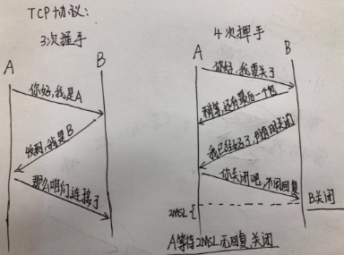

## 三次握手

### 三次握手过程
1. client发送请求主动进行连接
2. server收到请求后要进行确认联机确认
3. client收到确认后再次进行确认，连接建立

### 为什么是三次握手
1. client发送请求给server，server可以判断client具有发送能力
2. server收到后发送确认给client，client可以判断server有接收和发送能力
3. client收到确认后发送确认回复给server，server可以判断client有接收能力

### 四次挥手过程
1. client发送请求$\color{red}主动要求断开$连接
2. server收到后发$\color{red}送确认信息$（ACK），$\color{red}进入等待关闭状态$（server$\color{red}不能再读取数据$，但可以向client$\color{red}发送数据$）
3. client$\color{red}收到确认信息后进入等待状态$，等待server发送关闭信息（FIN）
4. server$\color{red}完成数据发送，发送关闭信息$（FIN），此后server$\color{red}不能再发送数据$
5. client收到关闭信息（FIN）后，$\color{red}发送确认信息$（ACK），连接关闭，释放网络资源
6. server收到后，连接关闭，释放网络资源