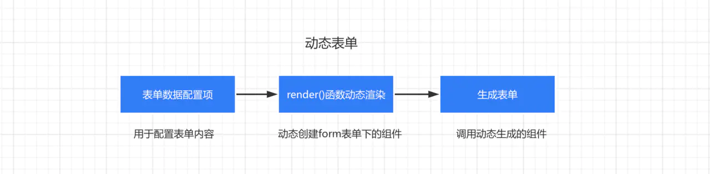

## 动态表单实现


### 实现步骤

#### dynamicFrom 
配置入口, 实现整体封装

#### formItemDynamic
主要作用: 表单项组件, 通过配置进行render

功能:
* 包装一层组件form-item, form-item主要功能设置标准样式, 绑定```blur事件```和```change事件```(在mounted和rule变化后$off和$on), 在事件触发回调里进行表单项验证; 表单验证使用的是```async-validatir```的npm包, 可以写入一个验证回调函数
* 根据需求包装一层拖拽组件drag, 这个是用于在管理系统中可视化编辑表单使用
* 根据需求包装一层拖拽组件layout, 这个是用于在外部添加一层icon布局


### 我的实现(遇到的问题)
实现功能: 在业务系统可以对目标字段进行监听, 添加回调方法

考虑1: 组件库做成了npm包; 所以考虑将回调传入将方法传入VNode配置里; 
考虑2: 编写render时发现在使用mode两属性, 经过排查发现render的第二个参数在vue1.0可以传入model属性, model属性下接受一个callback和value字段, callback是value变化时触发, 考虑改为2.0推荐写法.
考虑3: 上述完成后将传入的func放在input触发里执行, 动态表单里通过inject获取数据

### 未解决的问题

```js
// 业务组件只需要在目标时机$emit- input
// render编写在props里给value字段传入值value1, 然后使用on绑定input事件, 在回调中修改value1然后执行外部传入的监听回调

// testByRender.js
import test1 from './test1.vue'
let dataValue = null

export default {
  components: {test1},
  render (h) {
    let dataValue = null
    let self = this
    return h('div', [
      h('test1', {
        props: { value: dataValue },
        on: {
          'input': (val) => {
            console.log(dataValue, val);
            debugger
            dataValue = val
          }
        }
      })
    ])
  }
}

//--------------------------------------------

// 业务组件test1.vue
// <template>
//   <div>
//     <div>{{value1}}</div>
//     <input :value="value1" @input="handler" type="text">
//   </div>
// </template>

// <script>
// export default {
//   data () {
//     return {
//       value1: null
//     }
//   },
//   methods: {
//     handler (e) {
//       this.value1 = e.target.value
//       debugger
//       this.$emit('input', this.value1)
//     }
//   }
// }
// </script>


//--------------------------------------------
// 入口组件.vue

// <template>
//   <div>
//     ....
//     <testByRender></testByRender>	
//   </div>
// </template>


```


遇到的一个问题:this指向不正确, 首先考虑传入this, 最后使用箭头函数, 保证this.$emit触发的正确性