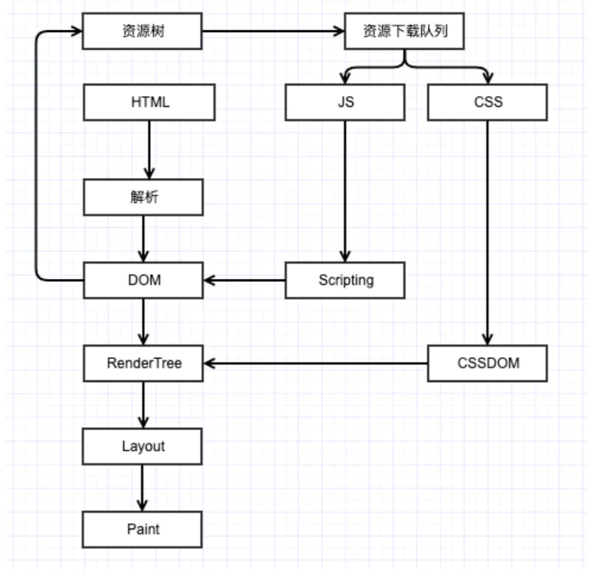

# 输入url到显示页面
1. 浏览器中输入网址
2. 域名解析（DNS），找到IP服务器
3. 发起TCP连接，HTTP三次握手,发送请求（Request）缓存策略
4. 服务器响应HTTP(Response) 
5. 浏览器下载资源 html css js images等
6. 浏览器解析代码（如果服务器有gzip压缩，浏览器先解压）
7. 浏览器渲染呈现给用户

## DNS
首先从dns缓存查询, 若没有找到则不停的向上一级请求dns服务器

查询方式:
* 递归查询(主机 ===> 本地dns服务器, 要么返回ip, 要么报错无法查询到)
* 迭代查询(本地dns ===> 外网其他dns, 要么返回ip, 要么告诉下一步去哪里查询)

## TCP

### 什么是TCP
控制传输协议

### 三次握手
> 目的: 为了防止已失效的连接请求报文段突然又传送到了服务端，因而产生错误 
 
1. client向server发送请求连接的信息 (server可以判断出client具备发送能力)
2. server收到client的信息, 向client发送确认信息 (client可以判断出server具备发送和接收能力)
3. client收到server的确认信息, 向server回应收到确认信息, 连接建立 (第三次 双方都保证接收和发送能力都没有问题)

### 四次挥手
(先发送请求的为client)
1. client发送一个断开请求(FIN), 并关闭client到server的数据传输
2. server收到请求, 发送一个确认序号(ACK), 确认序号为FIN + 1
3. server发送一个断开请求(FIN), 并关闭server到client的数据传输
4. client收到请求, 发送一个确认序号(ACK), 确认序号为FIN + 1, 与server断开

## 浏览器解析代码

1. 解析HTML, 构成DOM树
2. 解析CSS, 构造CSS规则(CSSOM)
3. 将DOM树和CSSOM生成render树
4. 布局render树(Layout/Reflow), 负责各元素尺寸, 位置的计算
5. 绘制render树(Paint), 负责颜色
6. 浏览器将各层的信息发给GPU, GPU将会合成然后显示在屏幕上

## 回流
**注意：回流一定会触发重绘，而重绘不一定会回流**

### 怎么样会触发回流？
1. DOM节点 增加 删除
2. DOM节点位置变化
3. 元素的尺寸 边距 填充 边框
4. DOM节点 display显示与否
5. 页面渲染初始化
6. 浏览器窗口尺寸变化 ->resize
7. 向浏览器请求某些样式信息 offset scroll client width height getComputedStyle()

### 怎么样减少回流？
1. 使用class改变样式， 避免使用style逐一修改
2. 使用文件片段
3. 对于复杂动画效果,使用绝对定位让其脱离文档流
4. css3硬件加速（GPU加速）

重绘